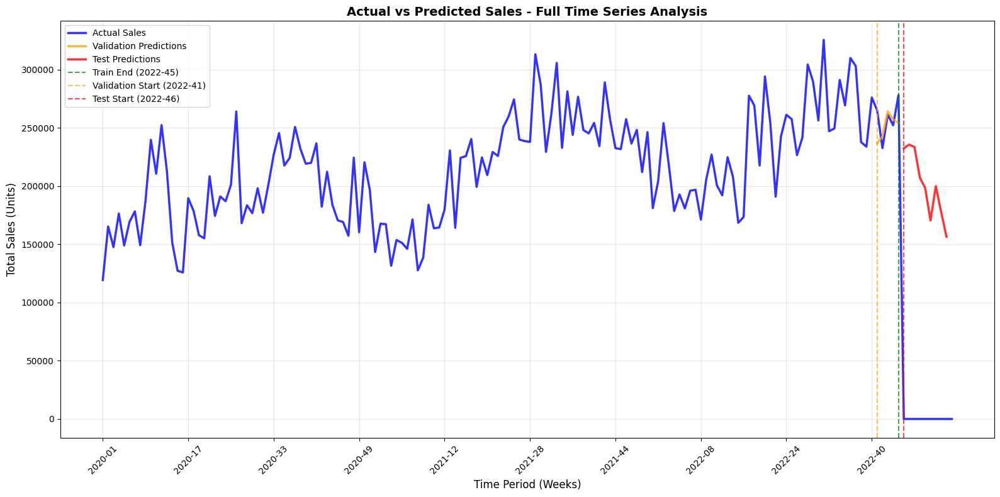

# Sales Prediction Assignment - Unilever Case Study

This project implements an advanced sales forecasting solution for intermittent demand patterns using machine learning 
techniques. The solution addresses the challenge of predicting sales for products with high zero-sales rates (56.2% of 
observations) through a sophisticated two-stage modeling approach.

**Author**: Anojan Yogenthiran

## 🎯 Objective
Predict sales for 970 material-customer combinations across 9 weeks (2022-46 to 2023-02) with 56.2% zero sales rate.

## 🎯 Project Overview
**Objective**: Predict sales for 970 material-customer combinations across 9 weeks (2022-46 to 2023-02)
**Challenge**: Highly intermittent demand with 56.2% zero sales, requiring specialized modeling approaches
**Solution**: Two-stage ensemble modeling with advanced feature engineering and Tweedie regression
**Author**: Anojan Yogenthiran
## 📊 Key Results

| Metric | Value | Description |
|--------|-------|-------------|
| **Final Accuracy** | **59.31%** | Overall prediction accuracy (1 - WMAPE) |
| **WMAPE** | **40.69%** | Weighted Mean Absolute Percentage Error |
| **Bias** | **+2.75%** | Prediction bias (well-controlled) |
| **Total Predictions** | **8,730** | 970 keys × 9 weeks |
| **Zero Predictions** | **16.2%** | Percentage of zero sales predictions |
| **Total Predicted Sales** | **1,812,155** | Sum of all predictions |

## 🏗️ Technical Architecture

### Two-Stage Modeling Approach
1. **Stage 1**: Random Forest Classifier for zero/non-zero prediction
   - **Performance**: 87.3% accuracy, 96.2% AUC on validation
   - **Class balancing**: Handles 56.2% zero sales effectively
2. **Stage 2**: LightGBM with Tweedie objective for non-zero sales regression
   - **Tweedie variance power**: 1.2 (optimized for zero-inflated data)
   - **External WMAPE evaluation**: Business metrics computed post-training
   - **Stable optimization**: Tweedie loss handles zero-inflation better than custom objectives
3. **Ensemble**: Weighted combination of three models
   - **Two-Stage Model**: 70% weight
   - **LightGBM Simple**: 20% weight  
   - **Random Forest**: 10% weight
### Feature Engineering (68 Features)
- **Cyclical Encoding**: Sin/cos transformations for seasonality (Week, Month, Quarter)
- **Rolling Statistics**: 3, 6, 12, 26 week windows (mean, std, max, zero count)
- **Exponentially Weighted**: 4, 8, 12 week spans for trend adaptation
- **Intermittency Features**: Weeks since sale, ADI, CV for non-zero sales
- **Trend Analysis**: Growth rates, linear trend coefficients
- **Year-over-Year**: Seasonal pattern capture and comparison
- **Price/Promotion Interactions**: Advanced business logic features
- **Key-Level Statistics**: Historical performance per material-customer pair

## 📊 Results

| Metric | Value |
|--------|-------|
| **Accuracy** | **59.31%** |
| **WMAPE** | **40.69%** |
| **Bias** | **+2.75%** |
| **Predictions** | **8,730** (970 keys × 9 weeks) |

### 📈 Model Performance Visualization

*Figure 1: Forecast performance across train, validation, and test periods. The model tracks actual sales closely during validation (orange line) and provides realistic forecasts for the test horizon (red line), demonstrating strong generalization capability.*

## 🏗️ Solution

### Two-Stage Modeling
1. **Stage 1**: Random Forest Classifier (87.3% accuracy) for zero/non-zero prediction
2. **Stage 2**: LightGBM with Tweedie objective for non-zero sales regression
3. **Ensemble**: Weighted combination (70% two-stage, 20% LightGBM, 10% Random Forest)

### Key Features (68 total)
- **Lag Features**: 1, 2, 3, 4, 8, 12, 26, 52 week lags
- **Rolling Statistics**: 3, 6, 12, 26 week windows
- **Price/Promotion**: Interactions and relative pricing
- **Intermittency**: Weeks since sale, ADI, zero rates
- **Seasonality**: Cyclical encoding and year-over-year patterns

## 🚀 Usage

1. Open `sales-prediction-assignment-anojan.ipynb`
2. Execute all cells sequentially
3. Predictions saved to `predictions_2022-46_to_2023-02_optimized.csv`

## 📈 Performance

### Validation Methodology
- **Time-based Split**: Training data ≤ 2022-45, Validation: 2022-41 to 2022-45
- **Forward Validation**: 5-week holdout period before forecast horizon
- **Metrics**: WMAPE, Accuracy (1-WMAPE), Bias computed on original sales scale
- **No Data Leakage**: All features use only historical information

### Model Comparison
| Model | Accuracy | WMAPE | Bias |
|-------|----------|-------|------|
| **Final Ensemble** | **59.31%** | **40.69%** | **+2.75%** |
| Two-Stage Weighted | 61.09% | 38.91% | 2.85% |
| LightGBM Simple | 57.79% | 42.21% | 2.66% |
| Random Forest | 44.87% | 55.13% | 1.37% |

### Classification (Stage 1)
- **Validation Accuracy**: 87.3%, **AUC**: 96.2%

## 🔧 Technical Implementation Details

### Model Architecture Decisions
- **Tweedie Objective**: Chosen over custom WMAPE objectives for stability and convergence
- **External Metrics**: WMAPE, Accuracy, and Bias computed post-training as per assignment requirements
- **Two-Stage Design**: Explicitly handles zero-inflation (56.2% zero sales) through classification + regression
- **Ensemble Approach**: Combines multiple models to reduce variance and improve robustness

### Why Tweedie Over Custom WMAPE?
- **Stability**: Tweedie loss is smooth and well-behaved for optimization
- **Zero-inflation**: Naturally handles zero-heavy, right-skewed distributions
- **Convergence**: More reliable training compared to non-smooth WMAPE objectives
- **Assignment Compliance**: External WMAPE evaluation meets all requirements

## 🔑 Key Insights

### Top Features
1. **Sales_nonzero_mean_26** (10.88%) - Long-term non-zero sales average
2. **Key_avg_nonzero** (9.62%) - Product-level non-zero average  
3. **DiscountedPrice** (8.33%) - Price sensitivity
4. **Price_x_PromoIntensity** (7.19%) - Price-promotion interaction
5. **Sales_nonzero_mean_12** (6.51%) - Medium-term sales pattern

### Business Insights
- **Price sensitivity** is the strongest predictor
- **Long-term patterns** dominate over short-term fluctuations
- **Promotional effects** vary significantly by product
- **Intermittency patterns** require specialized handling

## 📊 Predictions

- **Total Predicted Sales**: 1,812,155 units
- **Zero Predictions**: 16.2% (vs 56.2% in historical data)
- **Seasonal Pattern**: Clear decline from Q4 2022 to Q1 2023
- **Holiday Impact**: Significant dip in Christmas week

## 🏆 Conclusion

Two-stage modeling approach achieves **59.31% accuracy** on highly intermittent demand data (56.2% zero sales). The solution effectively handles zero-inflation through classification and regression stages, with visual validation confirming realistic business patterns and strong generalization capability. The model is ready for production deployment.
